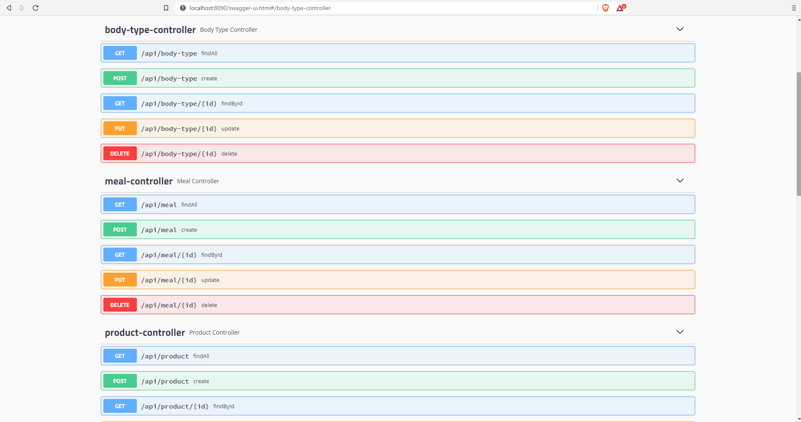
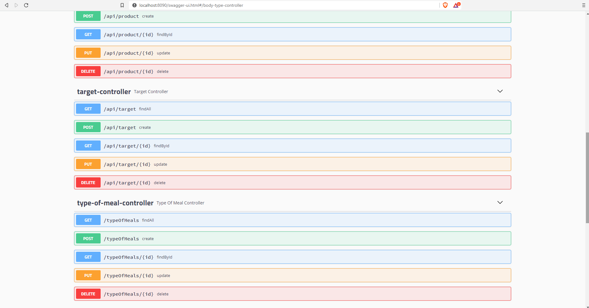
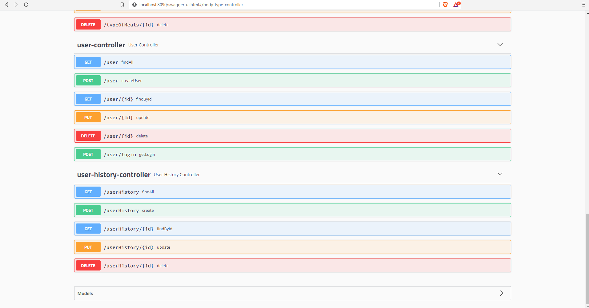
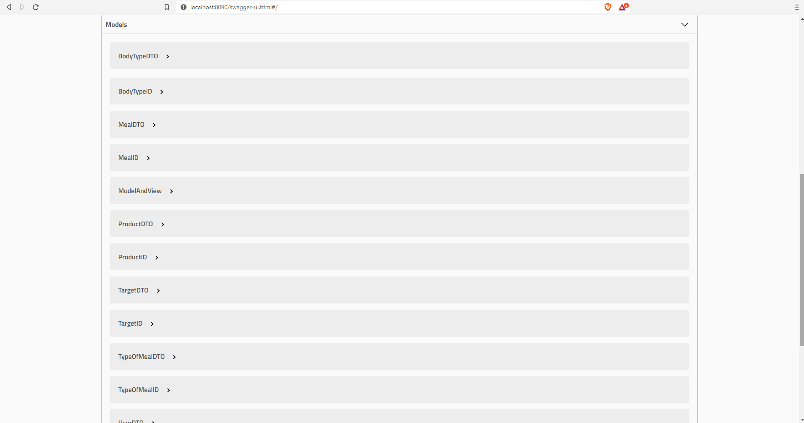

## About Aplication:

````
- Server developed in collaboration with Mykola Diedukh
- Current development status of the application on the branch calleddevelop
- The server communicates with the View Project created in Angular and with the database.
- We have created a rest server to communicate with our Angular Project.
- We have implemented Exception Handling to capture exceptions.
- We used Swagger for communication between two projects.
- We have implemented a Spring Security token to maintain basic Security for Our Users.
- We have implemented Integration tests & unit tests (Using  Mokckito, junit, AssertJ, MockMVC)
- We have implemented Data Transfer Object (DTO) to ensure data transfer between application layers.
-
````
## The application allows You to:

````
- register
- login in
- Create,Read,Update,Delete (CRUD) -> body-type,meal,product,target,type-of-meal,user,user-history.
````
## Languages and Tools Used:

````
- Java
- Spring
- Spring Boot
- Hibarnate
- Hibernate-validator
- Junit
- assertJ
- Mockito
- lombok
- swagger
- JJWT TOKEN
- h2 database
- Maven 
- MySQL databases
- Trello
````

## Swagger Docs:


````
````

````
````

````
````

````
````
## Registration & Login with JJWT TOKEN:


